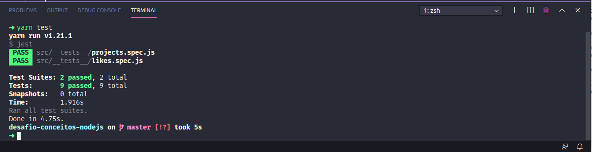

<h1 align="center">Desafio 02 Conceitos do Nodejs -  GoStack Turma 11</h1>

### Sobre o desafio

- Desafio 02 do bootcamp da Rocketseat onde apliquei os conceitos aprendidos no mõdulo <strong>Back-end com Node.js</strong>

### Objetivo
- Faça uma aplicação para armazenar repositórios do seu portfólio, que irá permitir a criação, listagem, atualização e remoção dos repositórios, e além disso permitir que os repositórios possam receber "likes".

### Testes
- Após a implementação dos requisitos os testes devem ser executados para que possa ser avaliado todos os pontos do desafio proposto

### Resultado dos testes:

**Rocketseat!! goStack11!! Desafio02 NodeJS!!**